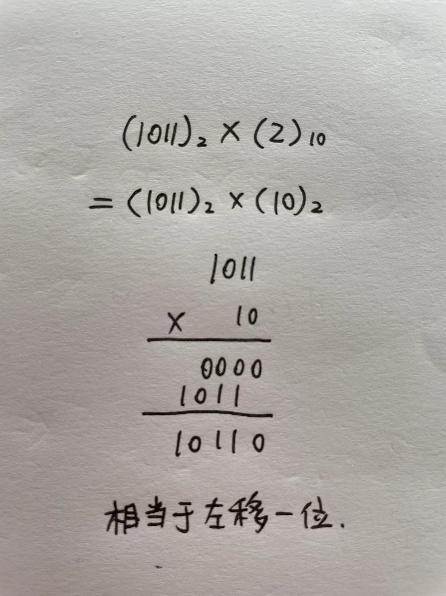

其实 bitwise 就是“按位”的意思。

位运算本质不是从数学来的，而是从计算机底层电路机制（二进制）来的，所以不要从数学角度理解，而是从计算机实现的角度理解。

## 六种基本操作

| 运算 | 英文        | 运算符 | 说明                                                       |
| ---  | ----------- | ------ | ---------------------------------------------------------- |
| 按位取反 | bitwise not | `~` | 0 变 1，1 变 0                                             |
| 按位或   | bitwise or |  `|`  | 只要有 1 就是 1，和布尔逻辑的 `or` 类似                    |
| 按位与   | bitwise and | `&`    | 都是 1 才是 1，否则为 0，和布尔逻辑的 `and` 类似           |
| 按位异或 | bitwise xor | `^`    | 不同的时候才是 1，否则为 0                        |
| 左移 | left shift  | `<<`   | 整体左移，高位丢弃，低位补 0                               |
| 右移 | right shift | `>>`   | 整体右移，低位丢弃，高位补 0（Python 如此，Java 补符号位） |

## 例子

### 位运算

```text
NOT 01
  = 10

0011 OR
0101 =
0111

0011 AND
0101 =
0001

0011 XOR
0101 =
0110

0011 LEFT SHIFT 2 =
1100

0011 RIGHT SHIFT 2 =
0000
```

### Python

```python
# 位运算
>>> bin(~0b01)
'-0b10'
>>> bin(0b0011 | 0b0101)
'0b111'
>>> bin(0b0011 & 0b0101)
'0b1'
>>> bin(0b0011 ^ 0b0101)
'0b110'
>>> bin(0b0011 << 2)
'0b1100'
>>> bin(0b0011 >> 2)
'0b0'
```

取反、或、与以及左移都很好理解，只有异或和右移要稍微记忆一下。

可以用 bit string 保存大量的 boolean 值，再通过位操作变更每个 boolean 值。

## 运算法则、规律

```python
# 对某一二进制位！

# XOR
n ^ 0 = n
n ^ 1 = ~x
n ^ n = 0

# AND
n & 0 = 0
n & 1 = n
n & n = n

# OR
n | 0 = n
n | 1 = 1
n | n = n
```

---

## Python 操作

```python
# 把十进制 1 转换为二进制数字的字符串表现形式
>>> bin(3)
'0b11'

# 二进制直接量，用 0b 开头，但是还是会表示为十进制
>>> 0b11
3
>>> 0b11 + 0b10
5

# 所有的数字不加 0b 都是十进制
# 这里是转换为二进制进行与运算后又转换为十进制得到 2
>>> 2 & 3
2
>>> bin(2)
'0b10'
>>> bin(3)
'0b11'
>>> 0b10
2
```

## 左移右移一位相当于乘除 2



```python
n * 2 = n << 1
# 对 Python 适用，因为-5 // 2 = -3
# Java就不行了，因为-5 / 2 = -2
n // 2 = n >> 1
```

## `n & (n - 1)`末位 1 变 0

.jpg)

```python
>>> for n in range(10):
...   print(bin(n), bin(n & (n - 1)))
...
0b0 0b0
0b1 0b0
0b10 0b0
0b11 0b10
0b100 0b0
0b101 0b100
0b110 0b100
0b111 0b110
0b1000 0b0
0b1001 0b1000
```

借此还能判断一个非负整数是不是2的某次方，因为这样的数二进制是一个1后面带0。

```python
n > 0 and n & (n - 1) == 0
```

## `n XOR n = 0`

一个数字和自身异或等于零。这可以在一个其它数字都出现两次的数组中找出只出现一次的数字。

```python
from functools import reduce
def find_only_once_int(nums):
    reduce(lambda cur, result)
```

## 找到末位 1 在哪一位

得到的这个数是末位 1 的位置为 1，其余为 0。比如 22 的二进制是 10110，则得到的数字是 10，即 00010。得到的这个数字 10 即 2，log2(2) 即得到是第几位为 1 了。

```python
# 两种方法
n ^ (n & (n - 1))
n & -n
```

---

#flashcards 

n & 1 (bitwise and)
?
1. 位运算判断奇偶
2. 二进制末位是不是零
3. 能不能被 2 整除
<!--SR:!2023-06-02,20,270-->